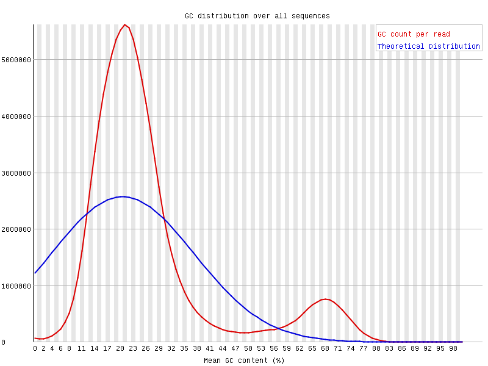
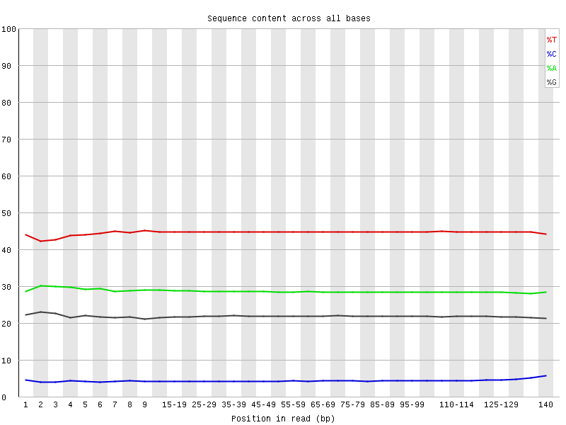
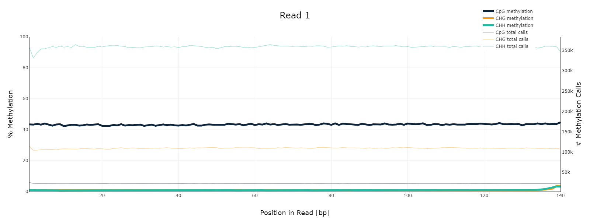
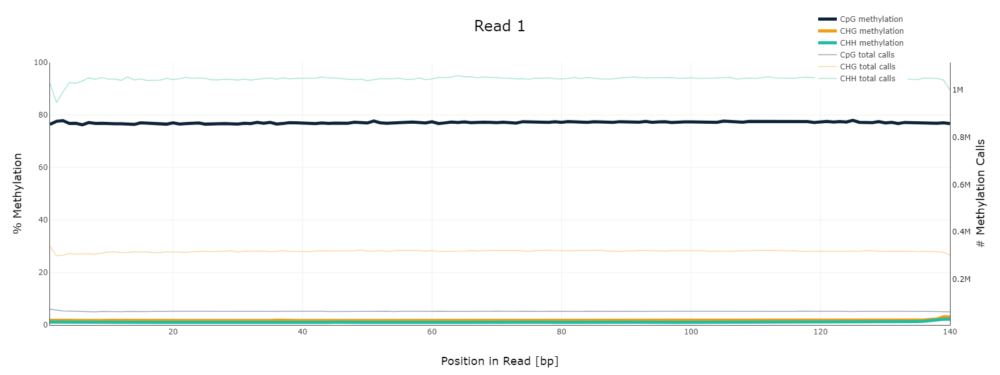
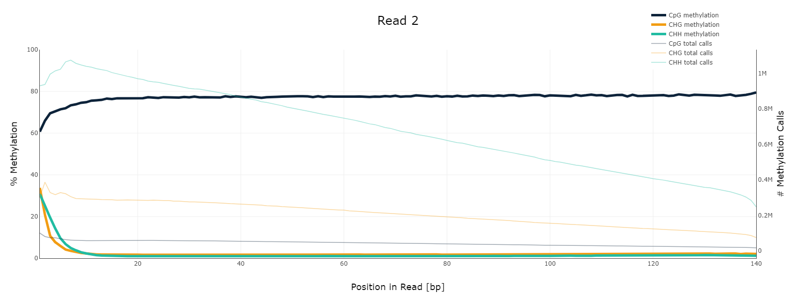
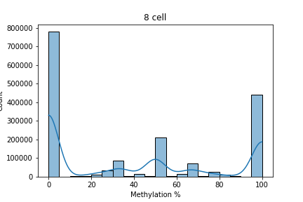
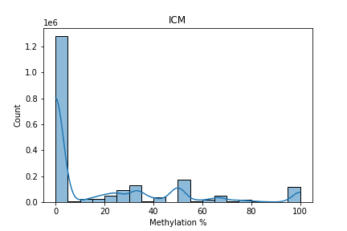
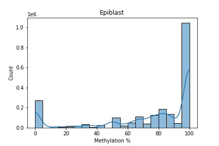
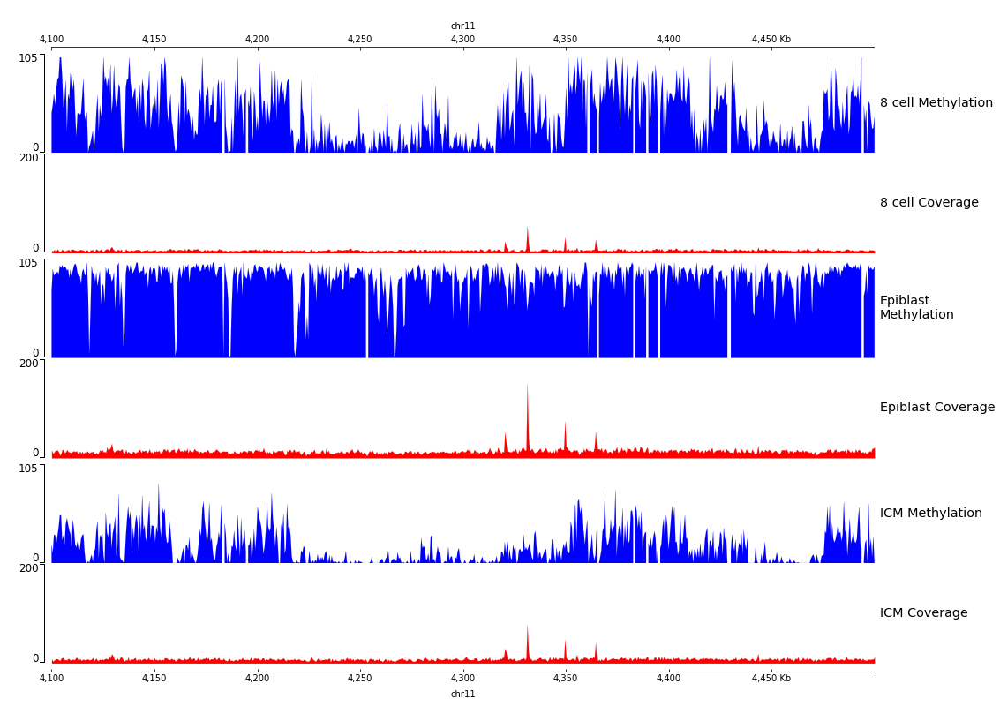

# [Google Colab](https://colab.research.google.com/drive/1seHwzHg786AdeMdxp6RmxuYSg4xNd9Fb?usp=sharing)

## Анализ QC прочтений
Был скачан файл SRR5836475_1.fastq и запущен FastQC: [отчёт](/data/SRR5836475_1_fastqc.html)  

*Какие особенности можно наблюдать по сравнению с секвенированием ДНК или РНК?*  
Единственная яркая особенность - необычный GC-состав.
Наблюдается два пика - намного меньше 50% (ок. 20%) и больше 50% (ок. 70%).
Это можно объяснить особенностями бисульфитного секвенирования: большая часть цитозина неметилирована, и в результате воздействия бисульфита превращается в урацил, который считывается как тимин.
Эта гипотеза подтверждается другим графиком, на котором видно, что количество A и G находится в норме (около 20-30%). В то время как C очень мало, а Т много (при этом эти кривые отстоят от A/G на одинаковом расстоянии).

GC cостав|	Соотношение нуклеотидов
-|-
 |	

## Stats
Stage |	Accession |	Reads at *11347700-11367700* |	Reads at *40185800-40195800* |	% Duplicated | Отчёт по коллингу
-|-|-|-|-|-
8 cell |	SRR5836473 |	1090 |	464 |	18.31% | [ссылка](/data/SRR5836473_1_bismark_bt2_PE_report.html)
ICM |	SRR5836475|	1456 |	630 |	9.08% | [ссылка](/data/SRR5836475_1_bismark_bt2_PE_report.html)  
Epiblast |	SRR3824222 |	2328 |	1062 | 2.92% | [ссылка](/data/SRR3824222_1_bismark_bt2_PE_report.html)  

### M-bias plots
8 cell |	ICM | Epiblast
-|-|-
 |	 |	
 |	 |	

Можно отметить, что в случае с обратной цепью (Read 2) есть одна особенность: в начале рида обычно обнаруживается чуть меньший или больший процент метилирования (разница до 20%). Возможно, это связано с особенностью проведения реакции.
Хотя "bias" не столь значителен, возможно, есть смысл игнорировать такие риды.

Также стоит отметить высокий процент метилирования в клетках эпибласта, что согласуется с данными статьи.

### Distribution of methylation
8 cell |	ICM | Epiblast
-|-|-
 |	 |	

### Coverage and Methylation plot

